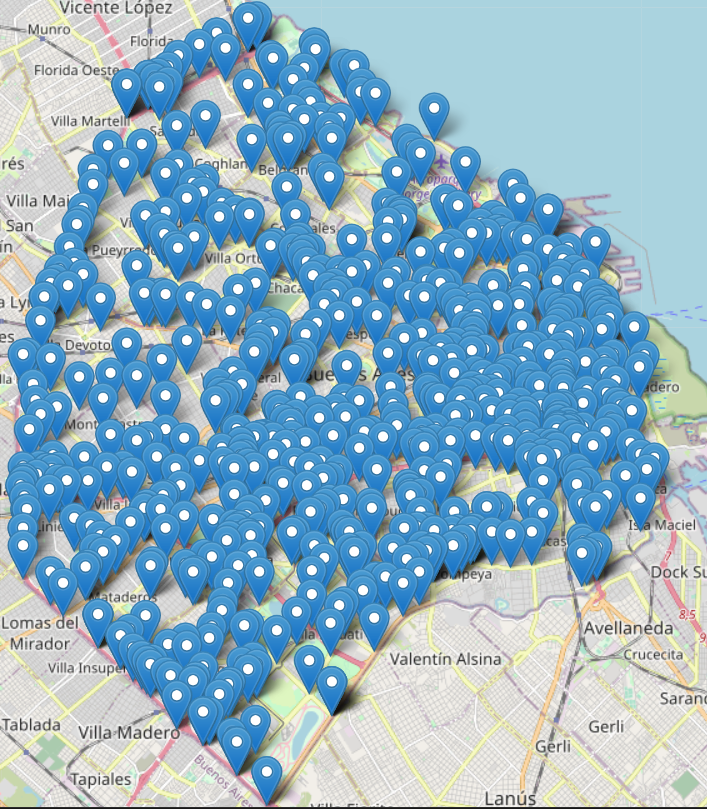
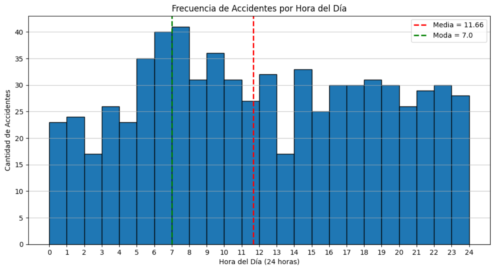

# Introducción

## El presente informe tiene como objetivo analizar el problema de los siniestros viales en Buenos Aires, específicamente en la Ciudad Autónoma de Buenos Aires (CABA), y proporcionar recomendaciones basadas en un proyecto de análisis de datos realizado para el Observatorio de Movilidad y Seguridad Vial (OMSV) bajo la Secretaría de Transporte del Gobierno de la Ciudad Autónoma de Buenos Aires.

## Para abordar este problema, se llevó a cabo un proyecto de análisis de datos utilizando un dataset proporcionado por el OMSV. El dataset cubre el período de 2016 a 2021 e incluye dos hojas de datos, "Hechos" y "Víctimas", así como diccionarios de datos para facilitar la comprensión de la información.

# A continuación, se presentan los hallazgos clave del análisis de datos:

## Tipos de Datos y Columnas Relevantes: Se realizó una exploración inicial de los tipos de datos y se identificaron las columnas relevantes para el análisis.

## Eliminación de Columnas Innecesarias: Se eliminaron las columnas que no aportaban información relevante al estudio.

## Identificación y Manejo de Duplicados: Se verificó la presencia de duplicados y se tomaron medidas para eliminarlos.

##  Tratamiento de Valores Faltantes: Se analizaron los valores faltantes y se aplicaron estrategias para lidiar con ellos.

_____________________________________________________________________________________________________________________________________
_____________________________________________________________________________________________________________________________________
_____________________________________________________________________________________________________________________________________
_____________________________________________________________________________________________________________________________________
_____________________________________________________________________________________________________________________________________
## Analizamos las edades de los accidentados vemos que la media es de 42 años

## Numero de victimas por año

## Distribucion de accidentes por comuna

## Análisis de Calles que se Repiten: Se examinaron las calles que presentaban un alto número de accidentes viales. La avenida general paz tenia muchos accidentes y eso se debe a que es una autopista de 24,3 km de extensión

## A CONTINUACION PODEMOS VER EN EL MAPA LA DISTRIBUCIÓN DE LOS ACCIDENTES

## EN ROJO LA AVENIDA GENERAL PAZ

## Horario de los Accidentes: Se observó una tendencia de accidentes durante la salida de boliches, sugiriendo una posible relación con el consumo de alcohol.

## Al analizar la cantidad de accidentes por mes se puede observar que diciembre suele tener una tasa mas eleveda de accidentes, distintas fuentes afirman que en el último mes del año se producen un 20 % más de siniestros; "la principal causa es el estrés acumulado de estos días", el jefe de Seguridad Vial del Cesvi . Otra causa son las cifras alarmantes sobre los jóvenes y el alcohol

## Frecuencia de Víctimas de Siniestros: Se determinó que la mayoría de las víctimas eran hombres y que las motocicletas estaban involucradas en un gran número de accidentes.

### Este dato coincide con las fuentes oficiales 

### Esta cifra tiene mucho que ver con estadisticas oficiales sobre el uso del casco (unica proteccion en motocicleta), como asi tambien la imprudencia al manejar

__________________________________________________________________________________________________________________________________________________________________________________________________________________________________________________________________________________________________________________________________________________________________________________________________________________________________________________________________________________________________________________________________________________________________________________________________________________________________________________________________________________________________________________________________________________________________________________________________________________________________________________________________________________________________________________________________________________________________________________________________________________________________
## Conclusion y Recomendaciones

1. **Mayor Control y Concienciación en Salidas Nocturnas:**
   Dado que se observó una tendencia de accidentes durante la salida de boliches, sugiriendo una posible relación con el consumo de alcohol, se recomienda implementar un mayor control y concienciación sobre la importancia de no conducir bajo los efectos del alcohol en horas nocturnas. Esto podría incluir campañas de educación vial y patrullas de control en áreas cercanas a establecimientos nocturnos.

2. **Reforzamiento de la Seguridad en Motocicletas:**
   Dado que la mayoría de las víctimas de siniestros viales son hombres y las motocicletas están involucradas en un gran número de accidentes, se recomienda enfocar esfuerzos en reforzar la seguridad en el uso de motocicletas. Esto incluye campañas para promover el uso del casco, así como el respeto de las normas de tráfico por parte de los conductores de motocicletas.

3. **Seguridad Vial en la Avenida General Paz:**
   Debido a que la Avenida General Paz presenta un alto número de accidentes viales, es importante considerar mejoras en la infraestructura vial de esta autopista. Esto podría incluir la implementación de medidas de seguridad adicionales, como señalización clara, iluminación adecuada y posiblemente la restricción de ciertas actividades que puedan contribuir a los accidentes en esta área.

4. **Campañas de Seguridad Vial Estacionales:**
   Dado que se observa un aumento significativo de accidentes en diciembre, posiblemente relacionado con el estrés y el consumo de alcohol durante las festividades, se sugiere la implementación de campañas de seguridad vial específicas para esta temporada. Estas campañas deben destacar la importancia de la prudencia al conducir y el peligro del consumo de alcohol al volante.

5. **Supervisión y Cumplimiento de Normas:**
   Es fundamental que las autoridades de tránsito supervisen y hagan cumplir las normas de tráfico de manera efectiva. Esto incluye la aplicación de sanciones adecuadas a quienes infrinjan las leyes de tráfico, como conducir bajo la influencia del alcohol o no utilizar casco en motocicletas.